# another_pixelart_platformer

## Start

* Download and install [Tiled](https://www.mapeditor.org/)
* The Tiled project is at assets/tiles/another_pixelart_platformer.tsx

## Creating a level

(In Tiled) File > New > New Map -> It should be 40 tiles wide and 23 tiles high, tile size being 16px - 16px

  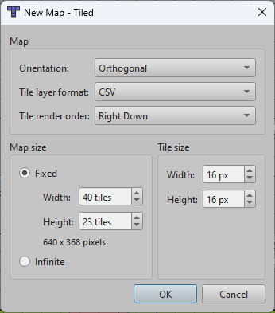

## Layers

There should be 3 layers:
* Background (Tile Layer) - For drawing the map
* SpawnPoints (Object Layer) - For spawning objects
* Collisions (Object Layer) - For the collision boxes

  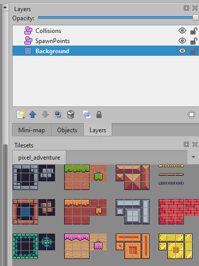

### Background Layer

You can use the tiles to draw the entire map.
(Example below is the default 'border')

  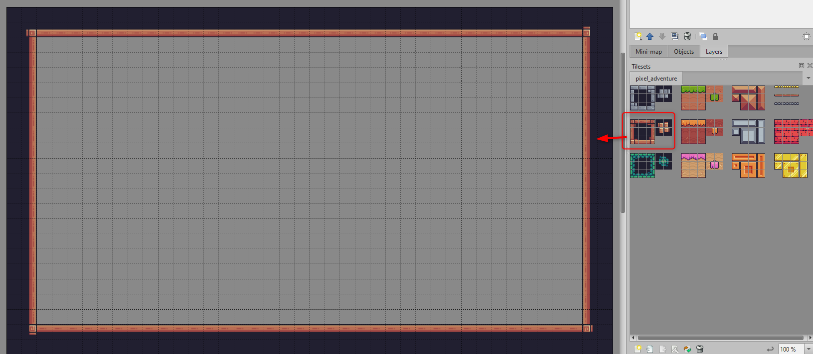

Then you can use the rest of the tileset to draw the rest of the map

  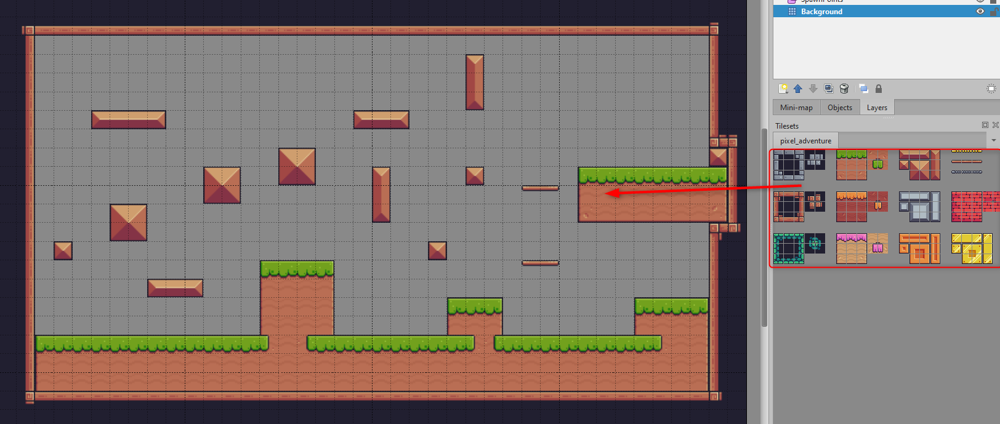

#### Background Color

If you click the "Background" Layer and right click on the custom properties section, you can create a new custom property called "BackgroundColor" with the type "string":

  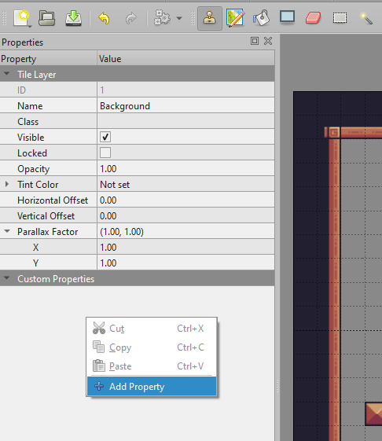

  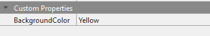

The usable values are listed below, this will tell the engine which image should be looped in the background:

  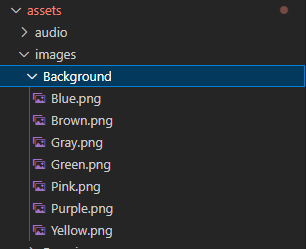

### Collision Layer

Drawing the tiles is not sufficient, we need "collision boxes" for the engine to know where we can move. Click the "Collisions" layer, then press "R" (to select the rectangle drawing tool) and start adding the collision boxes. The result should look something like this:

  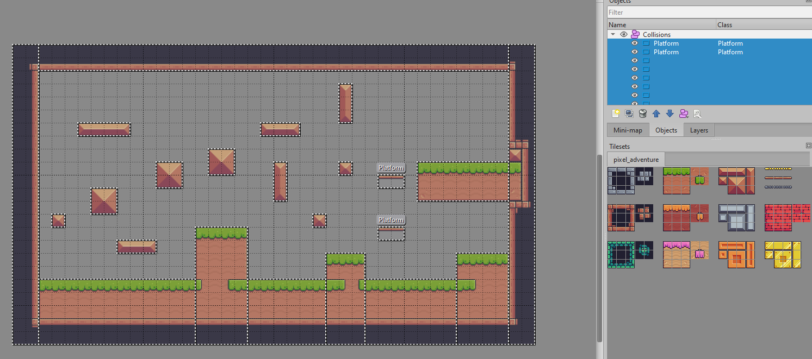

#### Platforms

  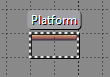

Platforms are special collision boxes. If you jump from below, they do not collide with the player, but if you come from above, they do. You can tell the engine that a collision box is a platform by adding the "Platform" keyword to the class of the collision box.

  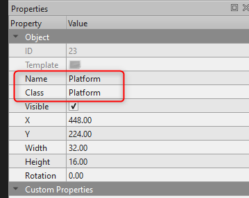

### SpawnPoints Layer

#### Spawning the Player

* Class: Player
* Required size: 2x2

  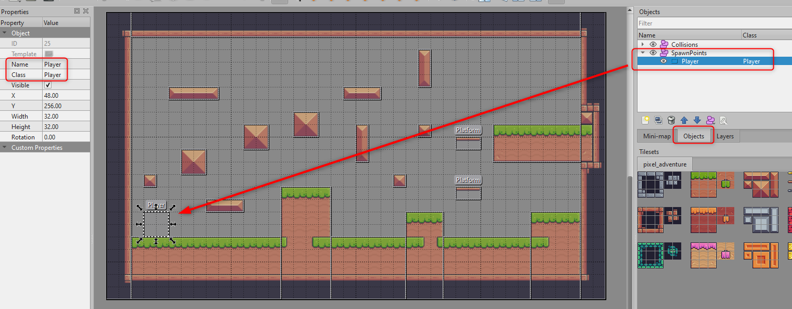

#### Checkpoint

* Class: Checkpoint
* Required size: 4x4

  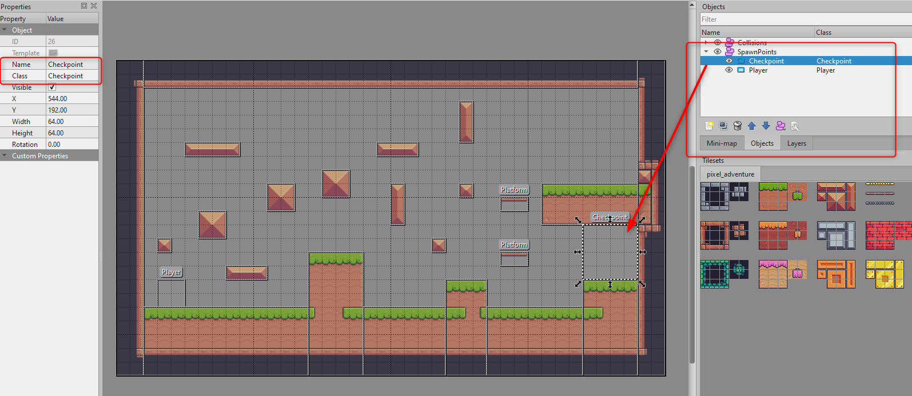

